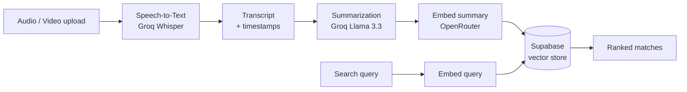

# Summarizer-AI

Upload an audio or video recording and get a clean, searchable summary. The app
transcribes speech to text, summarizes the key points with an LLM, and stores
every summary so you can search across them later with semantic (RAG) search.

## Table of Contents

- [Project Overview](#project-overview)
- [How It Works](#how-it-works)
- [Tech Stack](#tech-stack)
- [Prerequisites](#prerequisites)
- [Environment Variables](#environment-variables)
- [One-Time Setup](#one-time-setup)
  - [Backend (macOS / Linux)](#backend-macos--linux)
  - [Backend (Windows)](#backend-windows)
  - [Frontend](#frontend)
- [Running the App](#running-the-app)
  - [Option A: Launch script](#option-a-launch-script)
  - [Option B: VS Code task](#option-b-vs-code-task)
  - [Option C: Manual (two terminals)](#option-c-manual-two-terminals)
  - [Stopping the servers](#stopping-the-servers)
- [API Reference](#api-reference)
- [Project Structure](#project-structure)
- [Updating Dependencies](#updating-dependencies)

## Project Overview

Summarizer-AI turns long recordings into something you can actually use. Drop in
a lecture, meeting, or podcast and the app returns a concise summary along with a
timestamped transcript. Each summary is saved with a vector embedding, so the
search page can find the most relevant past summaries by meaning rather than by
exact keywords.

The work is split into three stages, which line up with the three parts of the
project:

1. **Speech-to-Text** converts the uploaded media into a transcript.
2. **LLM Summarization** condenses that transcript into a summary.
3. **RAG Search** embeds and stores summaries, then retrieves them by similarity.

## How It Works



1. **Speech-to-Text.** The backend extracts the audio track with `ffmpeg`,
   normalizes it, splits anything over 25 MB into chunks, and transcribes it with
   Groq's Whisper model. The result is full text plus per-segment timestamps.
2. **Summarization.** The transcript is sent to a Groq chat model, which returns
   the summary. The summary is embedded through OpenRouter and saved to Supabase.
   The frontend shows live progress for each stage over a streamed response.
3. **RAG Search.** A search query is embedded the same way and compared against
   the stored summary embeddings in Supabase, returning the closest matches
   ranked by similarity.

## Tech Stack

| Layer | Technology |
| --- | --- |
| Frontend | React 19, TypeScript, Vite |
| Backend | Python, FastAPI, Uvicorn |
| Speech-to-text | Groq `whisper-large-v3-turbo` |
| Summarization | Groq `llama-3.3-70b-versatile` |
| Embeddings | OpenRouter embedding model |
| Vector store / RAG | Supabase (Postgres + pgvector) |
| Media processing | ffmpeg / ffprobe |

## Prerequisites

- Python 3.11+
- Node.js 18+ (for the frontend)
- **ffmpeg**, required by the speech-to-text stage to extract audio from video
  files and split long audio into chunks.

Install ffmpeg:

- **Mac:** `brew install ffmpeg`
- **Windows:** `choco install ffmpeg` (or download a build from
  https://www.gyan.dev/ffmpeg/builds/ and add it to your PATH)

## Environment Variables

The backend reads its configuration from `backend/.env`. Copy the example file
and fill in your values:

```bash
cp backend/.env.example backend/.env
```

| Variable | Used for | Required |
| --- | --- | --- |
| `GROQ_API_KEY` | Transcription and summarization | Yes |
| `OPENROUTER_API_KEY` | Embeddings | Yes |
| `EMBEDDING_MODEL` | Embedding model name | Yes (example provided) |
| `DIMENSION` | Embedding size, must match the DB vector column | Yes (example provided) |
| `SUMMARY_MODEL` | Groq chat model for summaries | Yes (example provided) |
| `SUPABASE_URL` | Saving and searching summaries | For summarize + search |
| `SUPABASE_SERVICE_ROLE_KEY` | Saving and searching summaries | For summarize + search |

Notes:

- Get a Groq API key at https://console.groq.com/keys (free, no credit card).
- `/transcribe` only needs `GROQ_API_KEY`. The full summarize and search flow
  also needs `OPENROUTER_API_KEY` and a Supabase project.
- RAG search expects a Supabase `summarizations` table with a vector column and a
  `match_summarizations` similarity function. Coordinate with the team for the
  current database setup.
- `backend/.env` is gitignored. Never commit real keys.

The frontend can optionally point at a non-default backend through
`frontend/.env`:

```bash
cp frontend/.env.example frontend/.env
```

`VITE_API_BASE` defaults to `http://127.0.0.1:8000` when unset.

## One-Time Setup

Do this once after cloning. After it is done, use one of the options in
[Running the App](#running-the-app) for daily startup.

### Backend (macOS / Linux)

From the `backend` folder:

```bash
python3 -m venv venv
source venv/bin/activate
python -m pip install -r requirements.txt
```

### Backend (Windows)

From the `backend` folder:

```cmd
python -m venv venv
venv\Scripts\activate
python -m pip install -r requirements.txt
```

### Frontend

From the `frontend` folder:

```bash
npm install
```

## Running the App

Pick whichever option fits how you work. All three run the same two servers:
the backend on `http://127.0.0.1:8000` and the frontend on
`http://localhost:5173`.

### Option A: Launch script

From the project root, this opens two terminal windows, one per server.

- **macOS:**

  ```bash
  ./run.sh
  ```

  If needed, make it executable once with `chmod +x run.sh`.

- **Windows:** double-click `run.bat`, or from a command prompt at the project
  root:

  ```cmd
  run.bat
  ```

### Option B: VS Code task

This also works in VS Code-based editors such as Cursor, Windsurf, and
VSCodium, since they read the same `.vscode/tasks.json`.

With the project open in your editor:

- Press **Cmd+Shift+B** (Windows: **Ctrl+Shift+B**) — the `dev` task is the
  default build task — or
- Open the Command Palette (**Cmd+Shift+P**, Windows: **Ctrl+Shift+P**), choose
  **Tasks: Run Task**, then pick **dev**.

This launches both servers in split integrated terminals. The task picks the
correct backend script per operating system automatically.

### Option C: Manual (two terminals)

Backend, from the `backend` folder:

```bash
./run_server.sh        # macOS / Linux
run_server.bat         # Windows
```

Frontend, from the `frontend` folder:

```bash
npm run dev
```

### Stopping the servers

- In a terminal window or panel, press **Ctrl+C**.
- In VS Code (or Cursor, Windsurf, etc.), open the Command Palette
  (**Cmd+Shift+P**, Windows: **Ctrl+Shift+P**) and run:

  ```
  Tasks: Terminate Task
  ```

  Then choose the task to stop, or pick **All Running Tasks** to stop both
  servers at once.

## API Reference

The backend is a FastAPI app. Interactive docs are available at
http://127.0.0.1:8000/docs once it is running.

| Method | Endpoint | Description |
| --- | --- | --- |
| `POST` | `/transcribe` | Accepts an audio or video file, returns transcript text and per-segment timestamps. |
| `POST` | `/summarize` | Accepts an audio or video file, streams stage progress (Server-Sent Events), and returns the saved summary. |
| `POST` | `/chat` | Accepts a search query and returns the most similar stored summaries. |

`/transcribe` returns JSON like:

```json
{
  "text": "Full transcript of the audio...",
  "segments": [
    { "start": 0.0, "end": 4.2, "text": "First segment of speech" },
    { "start": 4.2, "end": 9.8, "text": "Second segment of speech" }
  ]
}
```

Notes:

- Video files work too. ffmpeg pulls the audio track automatically. Tested with
  MP3, MP4, WAV, M4A.
- Large files over 25 MB are split into 20-minute chunks and stitched back
  together, so long recordings work fine.
- Whisper handles roughly 100 languages out of the box; no need to specify one.
- Because `/summarize` streams Server-Sent Events, the Swagger page shows its raw
  stream rather than a formatted JSON block. The frontend is the best way to
  exercise it.

## Project Structure

```
.
├── backend/            FastAPI app
│   ├── routes/         transcribe, summary, chat endpoints
│   ├── controllers/    summarize and chat logic
│   ├── utils/          audio, transcription, embeddings, timestamps
│   ├── config.py       environment settings
│   ├── db.py           Supabase client and inserts
│   └── run_server.sh   backend launch script (run_server.bat on Windows)
├── frontend/           React + Vite app
│   └── src/
│       ├── components/ Summarizer and Chat (search) views
│       ├── api.ts      backend client
│       └── format.ts   timestamp and date helpers
├── run.sh              launch both servers (macOS)
├── run.bat             launch both servers (Windows)
└── .vscode/tasks.json  "dev" task to run both in VS Code
```

## Updating Dependencies

To save the backend's current dependencies into `requirements.txt`, from the
`backend` folder with the venv active:

```bash
pip freeze > requirements.txt
```
